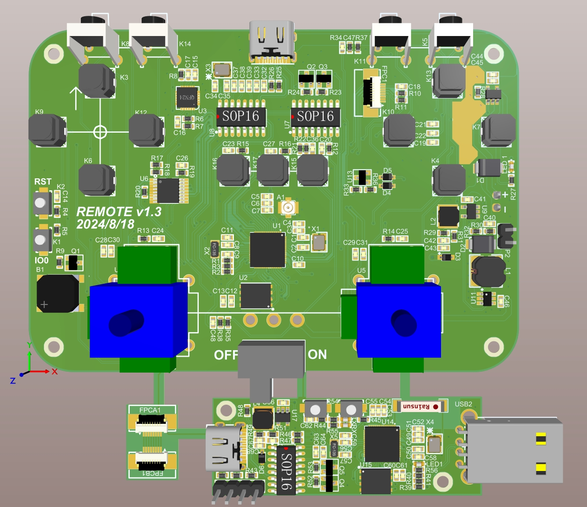
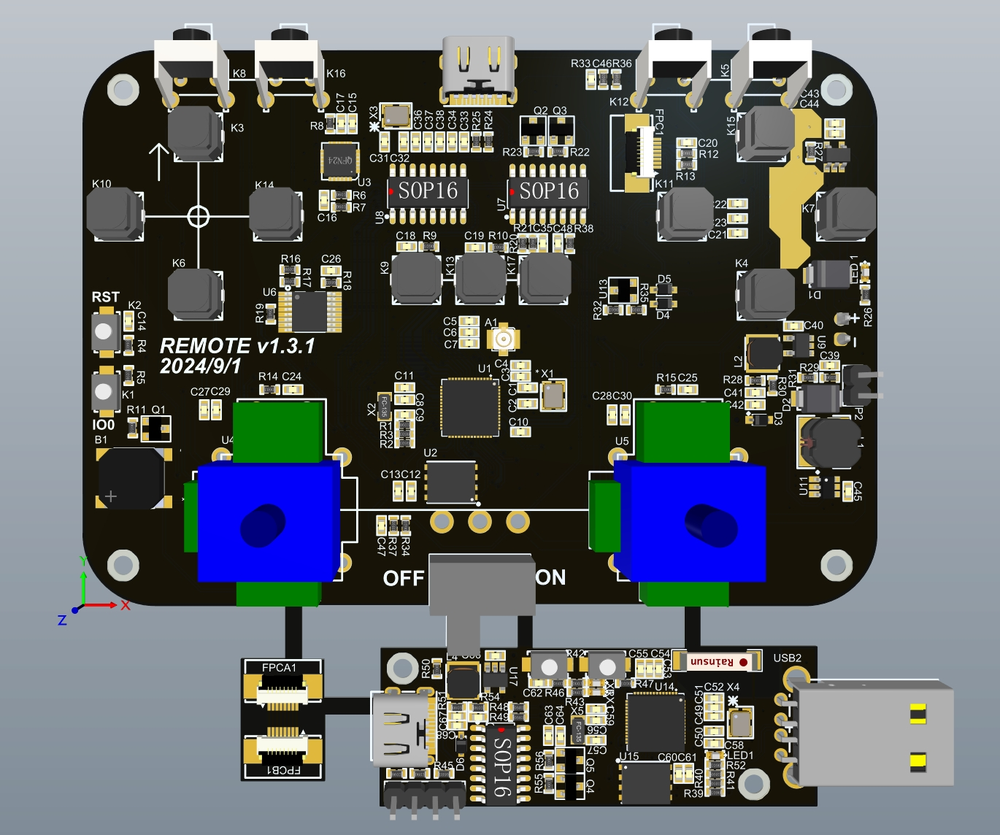

# V1.1 LOG 2024.4.10

## 设计实现

1、首版硬件主要实现了双USB，前面的是ESP32 USB，后面的USB用于调试；

2、实现基础的ESP32外围电路、下载电路、按键周围电路；

3、验证了摇杆封装；

4、为了实现更多的设备链接，增加了NRF2401模块用于实现2.4G射频前端；

5、增加了蜂鸣器；

6、电源部分使用3.7V升压方案，升压到稳定的5V，再降压到3.3V给系统电源使用；

7、可连接一块2.4寸TFT lCD屏幕；

8、确定了PCB形状和遥控器外形3D；

## 存在问题

1、前后两个USB过于累赘，下版本设计USB HUB芯片连接到一个USB口；

2、按键的手感不好，需要更改按键选型；

# V1.2 LOG 2024 6.22

## 设计实现

1、重新设计了按键选型；

2、添加USB HUB芯片可以是实现两个USB连接在一个USB口上；

3、增加了IO拓展芯片。

## 存在问题

1、2.4G通信模组实际使用中属于实际冗余，下一个版本需要去掉；

2、USB上拉引脚接错了，需要接在USB DP上；

3、IO拓展芯片的最好上拉值应设置在4.7K；

4、按键的引脚分配存在问题，不可以使用ESP32的某些引脚，下版本将这些引脚重新设置到IO拓展引脚上，部分引脚需要重新分配；

5、屏幕的位置比较难安装，屏幕排线需要延长，需要单独设计一块延长排线的转接板；

# V1.3 LOG 2024.8.18

## 设计实现

1、增加陀螺仪加速器芯片；

2、增加两个肩键在扫描电路上、增加CHA按键连接在ESP32 IO；

3、开机电路增加EN排针插座；

4、增加接收电路部分和排线电路；

5、重新布局布线；

## 存在问题

1、SPI1_CS放在IO拓展芯片上会降低SPI 通信速度，下版本将SPI1_CS 换到ESP32 GPIO7 ，将原本USB KEY换到 IO 拓展引脚；

2、KEY_SELECT和KEY_START按键的外部电路错误，下一版本需要将IO引脚上拉，按键另一端连接到GND；

3、MPU6050上拉电阻修改至2K；

4、PCA9557 IIC上拉修改至2K，IO0上拉修改至4.7K；

# V1.3.1 LOG 2024.8.29

## 设计实现

1、修改按键上拉和接地；

2、调换key_usb和SPI_CS引脚；

## 存在问题

暂无
